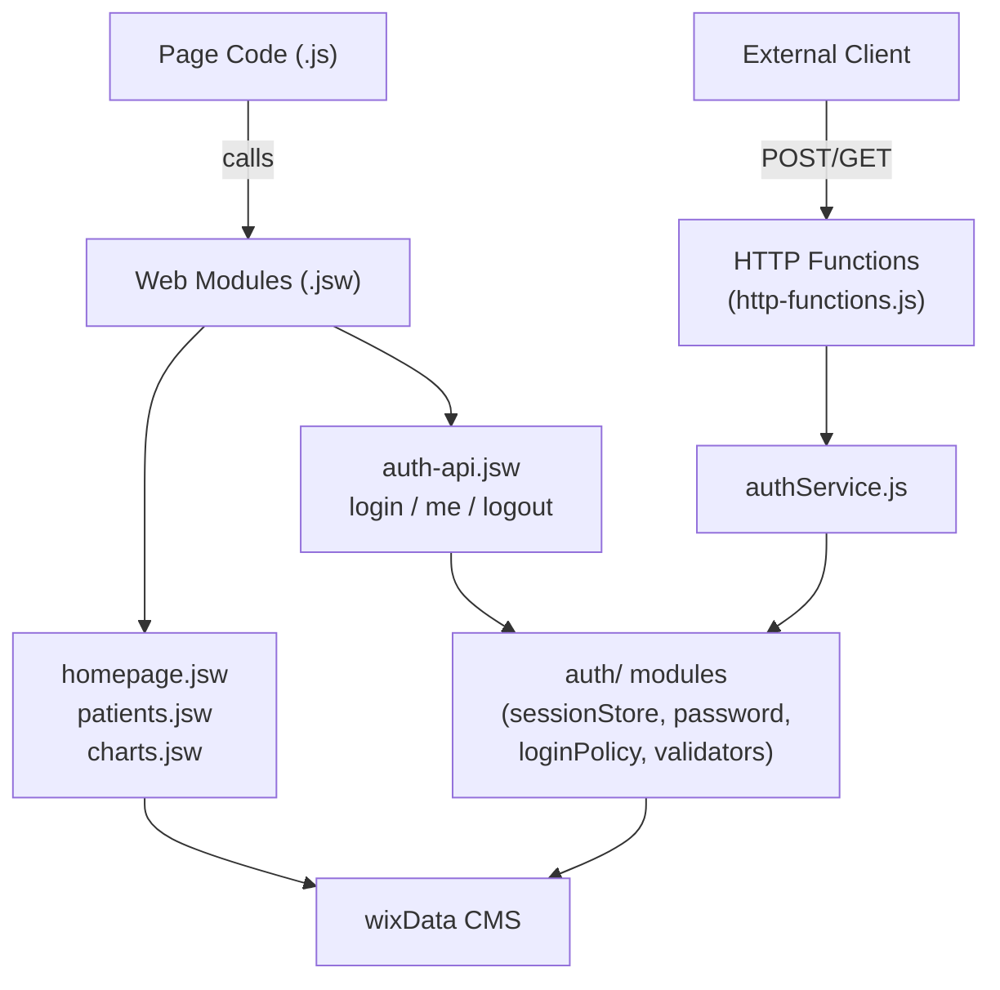

# Architecture Overview

## Tech Stack

| Layer       | Technology                                      |
|-------------|-------------------------------------------------|
| Platform    | Wix Velo (Wix CLI)                              |
| Language    | JavaScript (ES modules)                         |
| Data        | Wix Data CMS — 4 collections: CustomUsers, AuthSessions, Patients, Charts |
| Auth        | Custom email/password — does NOT use Wix Members |
| Server      | None — all data access is via Wix Data          |

## File Map

```
src/
  backend/
    http-functions.js        # HTTP endpoints: POST /login, POST /logout, GET /me (cookie-based)
    auth-api.jsw             # Web module: login(), me(), logout() — called from page code (sessionStorage-based)
    homepage.jsw             # Web module: dashboard summary, recent consultations, patient search
    patients.jsw             # Web module: savePatient(), getPatientById()
    charts.jsw               # Web module: chart CRUD — create, fetch, update
    patientValidation.js     # Pure validation helper for patient form payloads
    permissions.json         # Web method permissions (all data modules allow anonymous invoke)
    auth/
      authService.js         # HTTP-layer auth: parses cookies, builds Set-Cookie headers
      sessionStore.js        # CMS session CRUD: create, get (with expiry check), revoke
      password.js            # PBKDF2 password hashing and verification
      validators.js          # Email normalization and format validation
      loginPolicy.js         # In-memory rate limiter (5-attempt, 5-minute window)
      constants.js           # Auth config constants (lockout thresholds, collection IDs, etc.)
  pages/
    Log in.pv6yk.js          # Login page — calls auth-api.jsw login()
    homepage.j3uqr.js        # Dashboard — calls homepage.jsw + charts.jsw
    add new patient.cjdmk.js # Patient registration form — calls patients.jsw savePatient()
    add new chart.h8s12.js   # New chart creation — calls charts.jsw createChartForPatient()
    patient chart.ekygw.js   # Chart viewing/editing — calls charts.jsw
    Patient demographic.vtf4v.js  # Patient details view — calls patients.jsw + charts.jsw
    start up.c1dmp.js        # Startup/splash screen
    masterPage.js            # Global code: runs on every page, updates nav button label
  public/                    # (unused)
```

Page file names include Wix-assigned ID suffixes (e.g., `.pv6yk.js`). These are normal and must not be changed.

## Architecture Diagram



## Two Auth Paths

The system has two independent transports for auth. Both paths share the same `auth/` modules — only the transport layer differs.

**1. Web module path (`.jsw`)** — used by all pages in the app. Page code calls functions exported from `auth-api.jsw` directly (Wix RPC). The session ID returned on successful login is stored in `wix-storage` session storage under the key `custom_auth_session_id`. Subsequent page calls read that session ID and pass it to backend functions to verify identity.

**2. HTTP function path** — for external clients calling the site's HTTP endpoints (`POST /_functions/login`, etc.). Responses set an `HttpOnly` session cookie. The auth logic delegates to the same `auth/` modules as the web module path.

## Key Design Decisions

**1. Custom auth instead of Wix Members.** The app manages the full auth lifecycle: credential verification, session creation, lockout policy, and revocation. This avoids coupling the app's access control to Wix's member system, which cannot be customized to the same degree.

**2. All web methods allow anonymous invocation (`permissions.json`).** The app enforces its own session-based auth at the application layer. If Wix-level member checks were enabled on the web modules, they would block calls from users who are not Wix members — which is every user, since this app does not use Wix Members.

**3. `suppressAuth: true, suppressHooks: true` on all CMS queries.** Wix Data collection permissions would otherwise prevent backend code from reading or writing data on behalf of non-member site visitors. These flags bypass collection-level restrictions so backend functions can always access data regardless of the visitor's Wix identity.

**4. In-memory rate limiting (`loginPolicy.js`).** The in-memory limiter tracks failed login attempts within a 5-attempt, 5-minute window and resets on server restart. It acts as a first line of defense. Persistent lockout is handled by the `lockUntil` field on the `CustomUsers` CMS collection, which survives server restarts.

## Response Contract

Every backend function — in both web modules and auth modules — returns a consistent result shape. Page code always checks `result.ok` before reading any data fields.

```js
// Success
{ ok: true, ...data }

// Failure
{ ok: false, type: 'validation' | 'not-found' | 'conflict' | 'server', message: string }

// Auth failure (in auth-api.jsw)
{ ok: false, status: 400 | 401 | 429 | 500, error: string }
```
