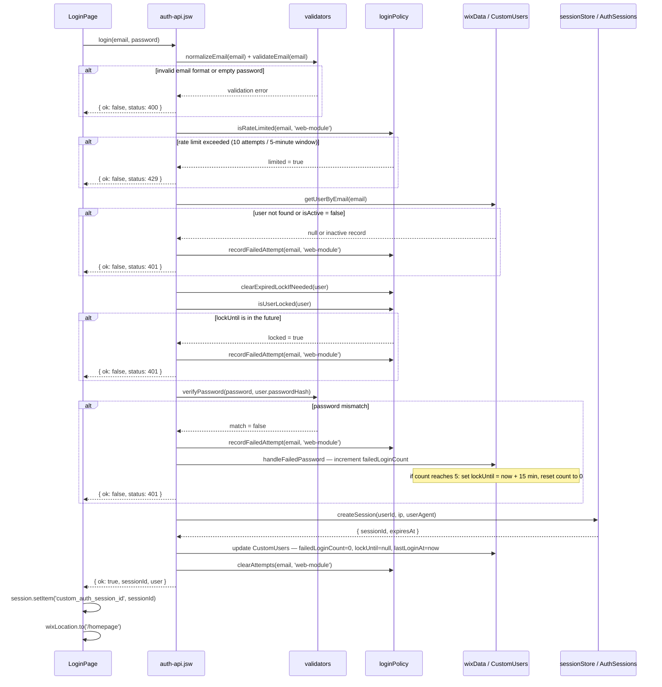
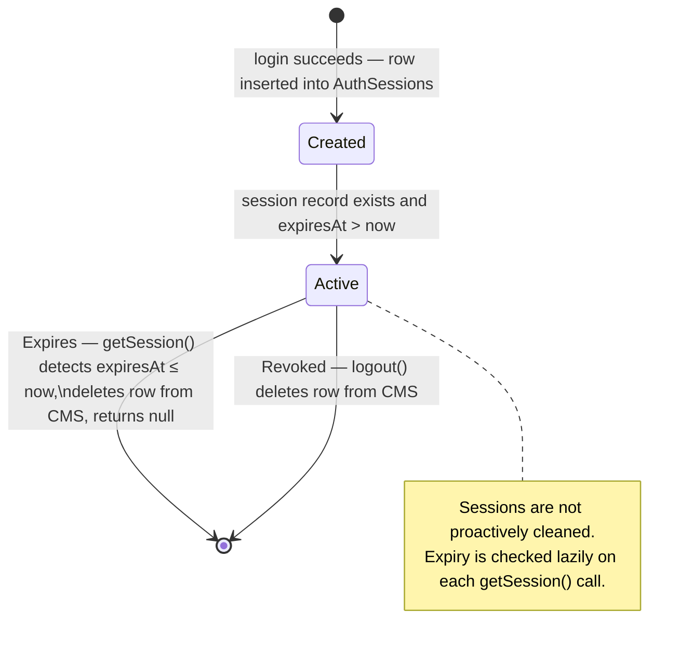

# Authentication System

## Overview

The authentication system is a fully custom email/password implementation built on top of Wix's CMS and backend infrastructure — it does not use Wix Members or any third-party auth provider. Authentication state is persisted in two CMS collections: `CustomUsers` (account records) and `AuthSessions` (active sessions with a 24-hour TTL). There are two parallel invocation paths: page code calls the `.jsw` web module and stores the session ID in `wix-storage`, while external clients call an HTTP function endpoint and receive a session cookie in the response. Both paths share the same underlying auth modules in the `auth/` directory.

---

## Auth Collections

### CustomUsers

| Field Name | Type | Notes |
|---|---|---|
| `email` | Text | Lowercase-normalized, unique index required |
| `passwordHash` | Text | Format: `pbkdf2$iterations$salt$hash` |
| `isActive` | Boolean | Inactive accounts are rejected at login |
| `role` | Text | Application-defined role string (e.g. `admin`) |
| `failedLoginCount` | Number | Increments on wrong password; resets to `0` on success or lockout |
| `lockUntil` | Date/Time | Nullable; set to `now + 15 min` after 5 consecutive failures |
| `lastLoginAt` | Date/Time | Nullable; updated to `now` on each successful login |

### AuthSessions

| Field Name | Type | Notes |
|---|---|---|
| `sessionId` | Text | Unique; 32 random bytes encoded as base64url |
| `userId` | Text | Foreign key to `CustomUsers._id` |
| `createdAt` | Date/Time | Set at session creation |
| `expiresAt` | Date/Time | `createdAt + 86400 seconds` (24 hours) |
| `ipHash` | Text | SHA-256 of the client IP address |
| `userAgent` | Text | Raw `User-Agent` header value |

---

## Two Auth Paths

### Web Module Path (Page Code)

Page code imports and calls `login(email, password)` from `auth-api.jsw`. The `.jsw` module runs in Wix's backend context and has access to `wix-data` for CMS reads and writes. On success, the function returns `{ ok: true, sessionId, user }` and the calling page stores `sessionId` in `wix-storage` session storage under the key `custom_auth_session_id`. Because the call originates from a `.jsw` file, the real client IP is not accessible — the rate limiter uses the literal string `'web-module'` as the IP component of the rate key.

### HTTP Function Path (External Clients)

External clients send `POST /_functions/login` with a JSON body. The request is handled by `http-functions.js`, which delegates to `authService.loginFromRequest(request)`. The service parses the body via `request.body.json()`, extracts the client IP from the `X-Forwarded-For` header, and passes both into the same shared `auth/` modules used by the web module path. On success, the HTTP response includes a `Set-Cookie` header; on failure, it returns a JSON error body with the appropriate HTTP status code.

---

## Login Flow — Web Module Path



---

## Login Flow — HTTP Function Path

```mermaid
sequenceDiagram
    participant Client
    participant http-functions.js
    participant authService.js
    participant auth as auth/ shared modules

    Client->>http-functions.js: POST /_functions/login { email, password }

    http-functions.js->>http-functions.js: request.body.json()
    http-functions.js->>http-functions.js: extract IP from X-Forwarded-For header
    http-functions.js->>authService.js: loginFromRequest(request)

    authService.js->>auth: login(email, password, realIp)
    note over auth: same validation, rate-limit, lockout, and<br/>password-verification flow as web module path.<br/>Rate key uses real IP instead of 'web-module'.

    alt login failure (400 / 401 / 429)
        auth-->>authService.js: { ok: false, status, message }
        authService.js-->>http-functions.js: error result
        http-functions.js-->>Client: HTTP status + JSON { error: message }
    end

    auth-->>authService.js: { ok: true, sessionId, user }
    authService.js-->>http-functions.js: success result

    http-functions.js-->>Client: 200 OK JSON body
    Note over http-functions.js,Client: Set-Cookie: custom_auth_session=sessionId<br/>HttpOnly; Secure; SameSite=Lax; Path=/; Max-Age=86400
```

---

## Session Lifecycle



---

## Auth Guard Pattern

Every protected page calls `enforceAuthGuard()` at the top of its `$w.onReady` handler:

```js
async function enforceAuthGuard() {
    const sessionId = session.getItem('custom_auth_session_id');
    const result = await meViaWebModule(sessionId);
    if (result?.ok) return true;
    wixLocation.to(`/log-in?redirect=${encodeURIComponent(currentPath)}`);
    return false;
}
```

`meViaWebModule` calls the backend `getMe(sessionId)` function, which runs `getSession()` against the `AuthSessions` collection. If the session is missing, expired, or the `sessionId` argument is null, `getMe` returns `{ ok: false }` and the guard redirects to `/log-in` with the current path encoded as a `redirect` query parameter so the login page can navigate back after a successful login.

`masterPage.js` does **not** enforce the guard. It reads auth state only to update the navigation button label (e.g. showing "Log Out" when a session is present). Page-level guard calls are the sole enforcement mechanism.

---

## Rate Limiting and Lockout

There are two independent layers of protection that operate at different scopes.

**In-memory rate limiting** (`loginPolicy.js`): An in-memory `Map` keyed by `email|ip` tracks timestamps of recent login attempts. If 10 or more attempts occur within any rolling 5-minute window, subsequent attempts return a 429 response immediately — before any database query is made. Old timestamps are pruned from the array on each check. Because this state lives in memory, it resets when the Wix backend instance restarts and is not shared across instances.

**CMS-persisted lockout** (`CustomUsers.lockUntil`): After 5 consecutive wrong-password attempts for a given account, `lockUntil` is set to `now + 15 minutes` and `failedLoginCount` is reset to 0. This state survives server restarts. On each login attempt, the system calls `clearExpiredLockIfNeeded` to remove a stale lock before checking `isUserLocked`, ensuring a previously locked account becomes accessible again once the lockout window has passed. A successful login clears both `lockUntil` and `failedLoginCount`.

| Parameter | Value |
|---|---|
| Rate limit window | 5 minutes |
| Rate limit threshold | 10 attempts |
| Rate limit key | `email\|ip` |
| IP value (web module path) | `'web-module'` (literal) |
| IP value (HTTP path) | Real IP from `X-Forwarded-For` |
| Failed attempts before lockout | 5 |
| Lockout duration | 15 minutes |

---

## Password Storage

Passwords are hashed with PBKDF2 using SHA-256, 120,000 iterations, a 16-byte random salt, and a 32-byte derived key. The hash is stored in `CustomUsers.passwordHash` as a single colon-free string in the format:

```
pbkdf2$<iterations>$<salt_hex>$<hash_hex>
```

Verification parses this format, re-derives the key using the stored salt and iteration count, and compares the result using a timing-safe byte comparison to prevent timing side-channel attacks.

---

## Provisioning and Operations

### CMS Setup

Create two CMS collections in the Wix dashboard: `CustomUsers` and `AuthSessions`. Add each field listed in the tables above with the correct type. Field names are case-sensitive and must match exactly — the backend code references them directly as CMS field keys.

### Setting Field Uniqueness

In the Wix CMS collection editor, open `CustomUsers`, select the `email` field, and enable the **Unique** constraint. Do the same for `sessionId` in `AuthSessions`. Without these constraints, the database will not enforce uniqueness and duplicate-key errors will be silent.

### Collection Permissions

Set both collections to **Admin only** for all operations (read, write, delete). The backend modules access CMS through elevated permissions using `wix-data`'s `suppressAuth` option where required, so page-level read access is not needed and would be a security liability.

### Seeding the First User

Use the provided script to generate a valid user record:

```bash
node scripts/generate-auth-user.mjs \
  --email "admin@example.com" \
  --password "StrongPassword123!" \
  --role "admin"
```

The script prints a JSON object to stdout. Paste the output as a new row in the `CustomUsers` CMS collection via the Wix dashboard. Do not manually construct `passwordHash` — the format and iteration count must match what the backend's `verifyPassword` function expects.

### Verify Login Page Element IDs

The login page handler attempts to bind to button elements by trying three IDs in order: `#loginButton`, `#submitButton`, `#signInButton`. It uses whichever exists. The remaining element IDs are fixed:

| Element | Expected ID |
|---|---|
| Email input | `#emailInput` |
| Password input | `#passwordInput` |
| Submit button | `#loginButton` or `#submitButton` or `#signInButton` |
| Error text | `#errorText` |
| Form container (optional) | `#loginform` or `#loginForm` |

If the login button is not responding, open the Wix Editor, select the button, and confirm its ID matches one of the three expected values.

### Preview vs Production

The `HttpOnly` and `Secure` cookie attributes on `custom_auth_session` mean the session cookie is not readable by JavaScript and is only transmitted over HTTPS. In Wix Preview mode (served over HTTP), the `Secure` attribute causes the browser to drop the cookie, so the HTTP function path will not persist sessions in preview. Use the web module path (`auth-api.jsw`) for testing in preview, or test the HTTP path against the published production URL.
