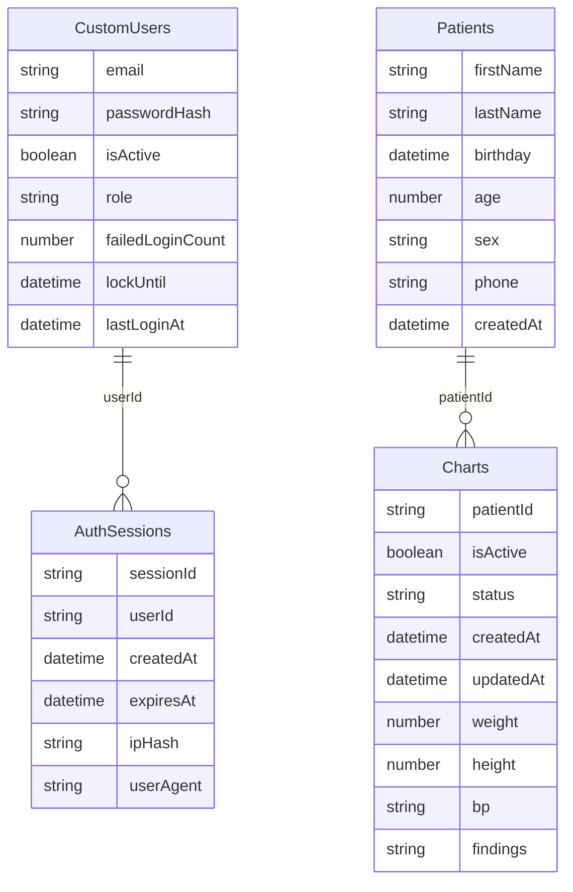

# Data Model

## Collections Overview

The STHMC application uses four Wix CMS collections. Two collections handle clinical data (`Patients`, `Charts`), and two handle authentication (`CustomUsers`, `AuthSessions`). All four are backend-only — no collection is exposed to site visitors, and all access bypasses Wix's built-in collection permission system via `suppressAuth`.

| Collection | Purpose |
|---|---|
| `CustomUsers` | Stores staff login credentials, roles, and account lockout state |
| `AuthSessions` | Tracks active login sessions with expiry and request fingerprinting |
| `Patients` | Stores patient demographics collected via intake form |
| `Charts` | Stores per-visit clinical data linked to a patient record |

## Entity Relationships



`CustomUsers` and `Patients` are intentionally unrelated. There is no foreign key between them — the auth system tracks who can log in to the application, not who receives care.

## Patients Collection

Populated by the backend when a patient intake form is submitted. The `sourceForm` and `createdAt` fields are always set by the backend, never by the client.

| Field | Type | Required | Notes |
|---|---|---|---|
| `firstName` | Text | Yes | Trimmed before insert |
| `lastName` | Text | Yes | Trimmed before insert |
| `birthday` | Date/Time | No | Validated if provided |
| `age` | Number | Yes | Integer, range 1–130 |
| `sex` | Text | Yes | |
| `address` | Text | No | |
| `phone` | Text | Yes | |
| `emergencyContactName` | Text | Yes | |
| `emergencyContactPhone` | Text | Yes | |
| `sourceForm` | Text | — | Always `"form2"`, set by backend |
| `createdAt` | Date/Time | — | Set by backend on insert |

## Charts Collection

Each chart record represents one clinical encounter for a patient. Charts are linked to a `Patients` record via `patientId`. Vital signs and clinical notes are all nullable — they are filled in as the visit progresses.

> **Business rule — one active chart per patient**
>
> When `createChartForPatient()` is called, the backend first sets `isActive = false` on all existing charts for that patient, then inserts the new chart with `isActive = true`. At any point in time, a patient has at most one active chart. Queries for "current chart" always filter by `isActive = true`.

| Field | Type | Required | Notes |
|---|---|---|---|
| `patientId` | Text | Yes | References `Patients._id` |
| `isActive` | Boolean | Yes | `true` for the current chart; `false` for all prior charts |
| `status` | Text | Yes | Set to `"open"` on creation |
| `createdAt` | Date/Time | — | Set on insert |
| `updatedAt` | Date/Time | — | Set on each update |
| `deactivatedAt` | Date/Time | No | Set when a chart is deactivated |
| `weight` | Number | No | |
| `height` | Number | No | |
| `temperature` | Number | No | |
| `bp` | Text | No | Blood pressure, free text (e.g. `"120/80"`) |
| `heartRate` | Number | No | |
| `respiratoryRate` | Number | No | |
| `department` | Text | No | |
| `findings` | Text | No | Clinical findings notes |
| `medicationsAd` | Text | No | Medications administered |
| `chartDate` | Date/Time | No | The date the chart pertains to |

## Auth Collections

`CustomUsers` and `AuthSessions` are documented in full in [02-authentication.md](./02-authentication.md), including the login flow, lockout behavior, and session lifecycle. The tables below are provided here for reference.

### CustomUsers

| Field | Type | Notes |
|---|---|---|
| `email` | Text | Lowercase, unique index required |
| `passwordHash` | Text | Format: `pbkdf2$iterations$salt$hash` (base64 salt and hash) |
| `isActive` | Boolean | Must be `true` to allow login |
| `role` | Text | e.g. `"admin"`. Used by pages for authorization |
| `failedLoginCount` | Number | Resets to `0` on successful login |
| `lockUntil` | Date/Time | Nullable. When set and in the future, login is refused |
| `lastLoginAt` | Date/Time | Nullable. Updated on successful login |

### AuthSessions

| Field | Type | Notes |
|---|---|---|
| `sessionId` | Text | Unique, 32-byte base64url random token |
| `userId` | Text | References `CustomUsers._id` |
| `createdAt` | Date/Time | Session creation time |
| `expiresAt` | Date/Time | 24 hours after `createdAt` |
| `ipHash` | Text | SHA-256 of client IP, or `"web-module"` for `.jsw` calls |
| `userAgent` | Text | HTTP User-Agent string, or `"web-module"` for `.jsw` calls |

## Data Access Patterns

All reads and writes to these collections go through backend `.jsw` web modules. No collection is directly queryable from the frontend or by site visitors.

Every `wixData` call passes both suppression options:

```javascript
wixData.query("Patients")
  .find({ suppressAuth: true, suppressHooks: true });

wixData.insert("Charts", chartItem, { suppressAuth: true, suppressHooks: true });
```

`suppressAuth: true` bypasses Wix's collection-level permission rules (which would otherwise block backend access to collections set to restricted visibility). `suppressHooks: true` prevents Wix's built-in data hooks from running, ensuring that validation and side effects are controlled exclusively by application code rather than by the CMS platform.

Because all access is backend-only, Wix CMS collection permissions for all four collections should be set to deny all visitor and member access. The collections serve as a persistence layer only — they have no direct relationship to Wix's member or contact systems.
