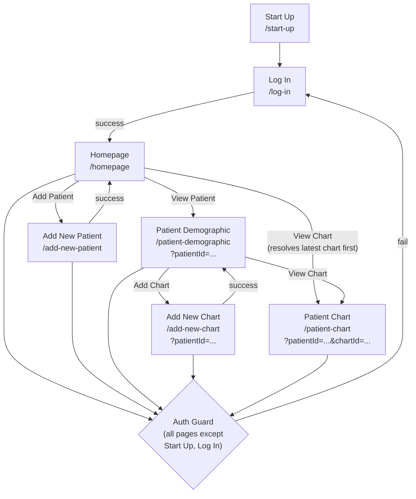

# Page Code Guide

## How Wix Page Code Works

Each page in the STHMC app has a corresponding JavaScript file under `src/pages/`. Wix assigns a unique ID suffix to each file (e.g., `Log in.pv6yk.js`) — do not rename these files or change the suffix, as Wix uses the suffix to bind the file to the correct page at build time. Spaces in filenames are intentional and must be preserved.

The entry point for every page is `$w.onReady()`. Code inside this callback runs after the page DOM is ready. The `$w(selector)` function selects page elements by ID (e.g., `$w('#emailInput')`).

Page code runs in the browser. To call server-side logic, import from a `.jsw` file in `src/backend/`:

```js
import { login } from 'backend/auth-api.jsw';
```

Wix enforces a strict browser/backend boundary — `.jsw` functions execute on the server, and their return values are passed back to the page asynchronously.

---

## Page Navigation Flow



---

## Protected Pages and the Auth Guard

Every protected page begins its `$w.onReady()` callback with an auth check before doing anything else:

```js
$w.onReady(async function () {
  const authed = await enforceAuthGuard();
  if (!authed) return;
  // page initialization continues here
});
```

`enforceAuthGuard()` does the following:

1. Reads `sessionId` from `wix-storage` session storage.
2. Calls `me(sessionId)` from `backend/auth-api.jsw` to validate the session server-side.
3. If the check fails (no session or invalid session), redirects to `/log-in?redirect=<currentPath>` and returns `false`.
4. If the check passes, returns `true` and the page continues loading.

The `if (!authed) return` guard is critical — it prevents the rest of the page initialization from running if the user is not authenticated. Without it, element selectors and backend calls would fire against an unauthenticated context.

Pages without an auth guard: `start up.c1dmp.js`, `Log in.pv6yk.js`, `Privacy Policy.ltzla.js`, `Fullscreen Page.lbv75.js`.

---

## Common Patterns

### Element Selector with Fallback

Wix editor element IDs can vary between editor versions or if an element was recreated. A fallback chain avoids hard failures when a selector is not found:

```js
function getElement(selectors) {
  for (const selector of selectors) {
    try {
      const element = $w(selector);
      if (element) return element;
    } catch (_err) {
      continue;
    }
  }
  return null;
}

// Usage
const button = getElement(['#loginButton', '#submitButton', '#signInButton']);
```

Pass an array of selectors in order of preference. The function returns the first match, or `null` if none are found. Always null-check the return value before calling methods on it.

### Loading and Submitting States

Disable interactive controls during async operations to prevent duplicate submissions:

```js
const defaultLabel = button.label;
button.disable();
button.label = 'Submitting...';

try {
  await someBackendCall();
} finally {
  button.label = defaultLabel;
  button.enable();
}
```

Restore the button in a `finally` block so it re-enables even if the backend call throws.

### Message Display

A shared pattern for showing success or error feedback to the user:

```js
const MESSAGE_SELECTORS = ['#formMessageText', '#formMessage'];

function setMessage(text, isError = false) {
  const el = getElement(MESSAGE_SELECTORS);
  if (!el) return;
  el.text = text;
  el.style.color = isError ? '#D32F2F' : '#388E3C';
  el.show();
}

// Usage
setMessage('Patient saved successfully.');
setMessage('Email or password is incorrect.', true);
```

Red (`#D32F2F`) for errors, green (`#388E3C`) for success.

### Query Parameters

Pages that operate on a specific patient or chart receive their context via URL query parameters:

```js
import wixLocation from 'wix-location';

$w.onReady(async function () {
  const authed = await enforceAuthGuard();
  if (!authed) return;

  const { patientId, chartId } = wixLocation.query;
  if (!patientId) {
    // handle missing param — redirect or show error
    return;
  }
  // proceed with patientId
});
```

Always validate that required params are present before making backend calls that depend on them.

### Repeater Rendering

Repeaters require a data array where every item has a unique `_id` string. Bind item elements inside `onItemReady`:

```js
repeater.data = items.map((item, i) => ({ _id: String(i), ...item }));

repeater.onItemReady(($item, itemData) => {
  $item('#name').text = itemData.patientName;
  $item('#date').text = itemData.date;
  $item('#viewButton').onClick(() => {
    wixLocation.to(`/patient-demographic?patientId=${itemData.patientId}`);
  });
});
```

Set `onItemReady` before assigning `data`, or reassign `data` after the handler is registered — otherwise item callbacks may not fire for the first render.

---

## Page Reference Table

| File | Route | Auth Guard | Backend Modules | Key Element IDs | Purpose |
|---|---|---|---|---|---|
| `start up.c1dmp.js` | `/start-up` | No | None | — | Splash/startup page. No logic. |
| `Log in.pv6yk.js` | `/log-in` | No | `auth-api.jsw` → `login()` | `#emailInput`, `#passwordInput`, `#loginButton` / `#submitButton` / `#signInButton`, `#errorText`, `#loginform` / `#loginForm` | Login form. On success, stores `sessionId` in session storage and redirects to `?redirect` param or homepage. |
| `homepage.j3uqr.js` | `/homepage` | Yes | `homepage.jsw`, `charts.jsw` → `getLatestChartForPatient` | `#totalPatient`, `#consultationCount`, `#activeDepartments`, `#recentConsultations`, `#search` / `#searchInput` | Dashboard. Shows summary counts, recent consultations repeater, and patient search. |
| `add new patient.cjdmk.js` | `/add-new-patient` | Yes | `patients.jsw` → `savePatient` | `#patientFirstName`, `#patientLastName`, `#patientBirthday`, `#patientAge`, `#patientSex`, `#patientAddress`, `#patientPhone`, `#emergencyContactName`, `#emergencyContactPhone`, `#formMessageText` / `#formMessage` | Patient intake form with field validation. Redirects to homepage on success. |
| `Patient demographic.vtf4v.js` | `/patient-demographic` | Yes | `patients.jsw` → `getPatientById`, `charts.jsw` → `getChartsForPatient` | `#firstName`, `#lastName`, `#birthDay`, `#age`, `#sex`, `#repeater1`, `#chartNo`, `#deparment`, `#date`, `#viewButton`, `#addChartButton` | Patient detail view. Shows demographics and chart history repeater. Entry point to adding or viewing a chart. Receives `?patientId` via query param. |
| `add new chart.h8s12.js` | `/add-new-chart` | Yes | `charts.jsw` → `createChartForPatient`, `charts.jsw` → `updateChartData` | `#weight`, `#height`, `#temperature`, `#bp`, `#heartRate`, `#respiratoryRate`, `#department`, `#findings`, `#medicationsAd`, `#datePicker1` | Chart creation form. Vitals, findings, and department entry. On success, returns to patient demographic with `?patientId`. Receives `?patientId` via query param. |
| `patient chart.ekygw.js` | `/patient-chart` | Yes | `charts.jsw` → `getChartContext` | `#weight`, `#height`, `#temperature`, `#bp`, `#heartRate`, `#respiratoryRate`, `#department`, `#findings`, `#medicationsAd`, `#datePicker1` | Chart viewer. Displays an existing chart, read-only or editable depending on context. Receives `?patientId` and `?chartId` via query params. |
| `masterPage.js` | All pages | No | `auth-api.jsw` → `me()` | `#button1` | Global page master. Updates the nav button label on every page load. Does not redirect. See [masterPage.js](#masterpagejs) below. |
| `Privacy Policy.ltzla.js` | `/privacy-policy` | No | None | — | Static privacy policy. No logic. |
| `Fullscreen Page.lbv75.js` | `/fullscreen` | No | None | — | Fullscreen page. Purpose TBD. No logic. |

---

## masterPage.js

`masterPage.js` is not a page — it is the Wix master page, and its code runs on every page load across the entire site. It has no route of its own.

Its only responsibility is updating the nav button label (`#button1`) based on whether the current user is authenticated:

- If a valid session exists: label is set to `"Home"`.
- If no session or the session is invalid: label is set to `"Log In"`.

It calls `me(sessionId)` from `auth-api.jsw` to check auth state, but it does **not** redirect on failure. Auth enforcement is the responsibility of individual protected pages via `enforceAuthGuard()`. Conflating the two would cause redirect loops or double-redirects.

Do not add page-specific logic to `masterPage.js`. Keep it limited to site-wide UI state that applies to every page equally.

---

## Adding a New Protected Page

Follow these steps in order when adding a new page that requires authentication:

1. **Create the page in the Wix editor.** Wix will generate a file under `src/pages/` with the page name and a Wix ID suffix (e.g., `My New Page.abc12.js`). Do not rename the file.

2. **Import the auth guard at the top of the page file.**

   ```js
   import { enforceAuthGuard } from 'public/auth-guard';
   ```

   Verify the import path matches where `enforceAuthGuard` is defined in the project.

3. **Add `$w.onReady` with the auth check as the first `await`.**

   ```js
   $w.onReady(async function () {
     const authed = await enforceAuthGuard();
     if (!authed) return;
     // your initialization code starts here
   });
   ```

4. **Import any backend modules you need** from `backend/*.jsw`. Do not call backend modules before the auth check completes.

5. **Read query parameters** with `wixLocation.query` if the page expects a `patientId`, `chartId`, or other context. Validate that required params are present and show an error or redirect if they are missing.

6. **Use `getElement()` for all element selectors** rather than calling `$w()` directly. If an element ID might vary, pass a fallback array.

7. **Wrap async operations in loading states.** Disable buttons before backend calls and re-enable them in a `finally` block.

8. **Use `setMessage()` for user feedback.** Do not write raw error strings directly into element text — route all feedback through the message display pattern so error/success styling is consistent.

9. **Update the Page Reference Table** in this document with the new file name, route, auth guard status, backend modules, key element IDs, and purpose.

10. **Update the navigation flow diagram** in this document if the new page is reachable from or navigates to any existing page.
